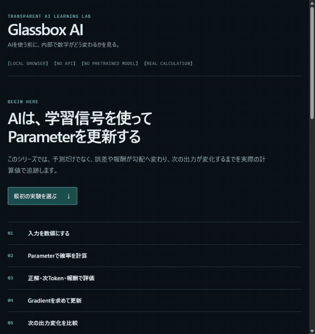
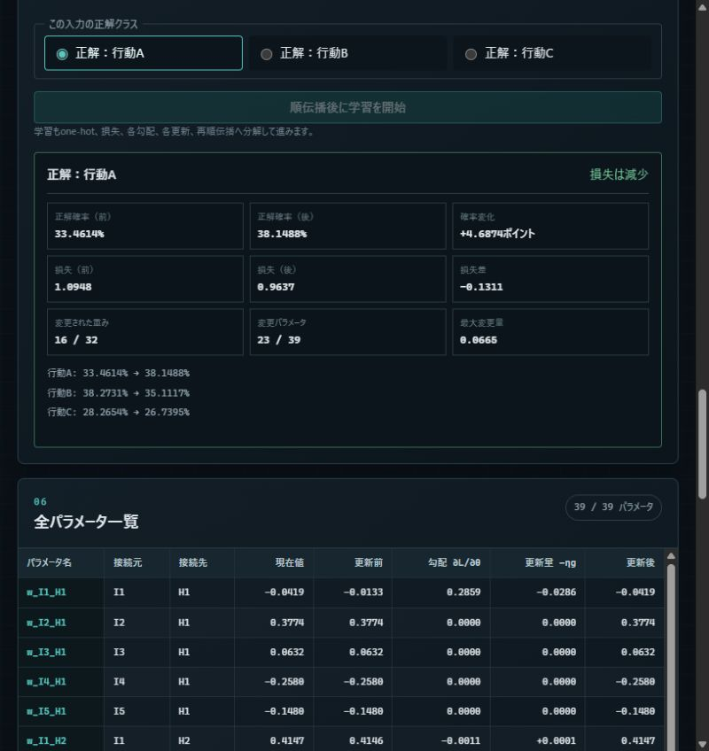
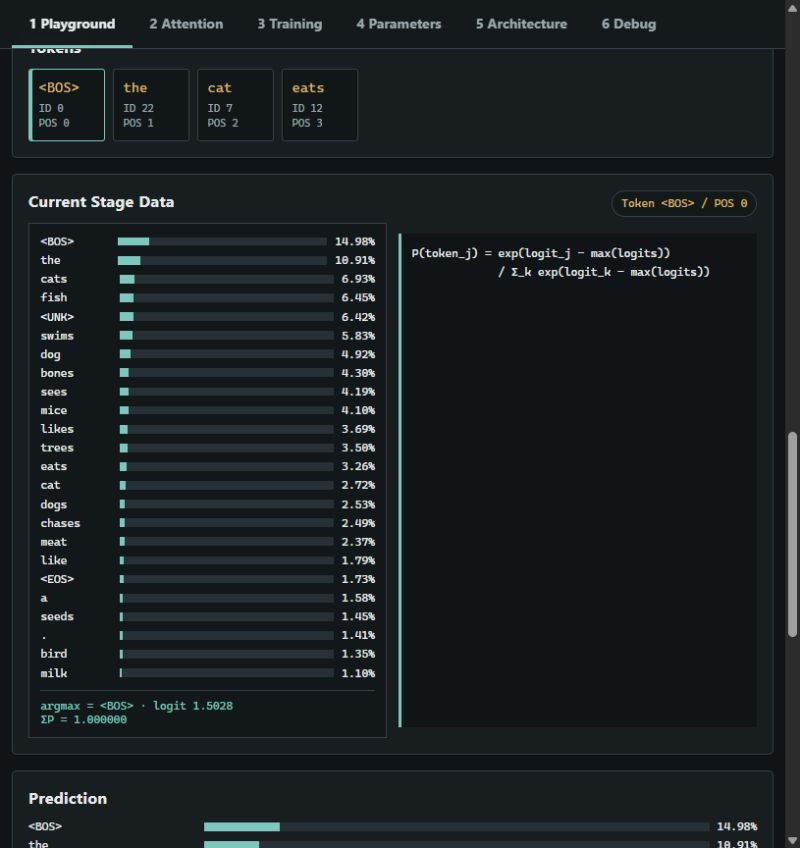
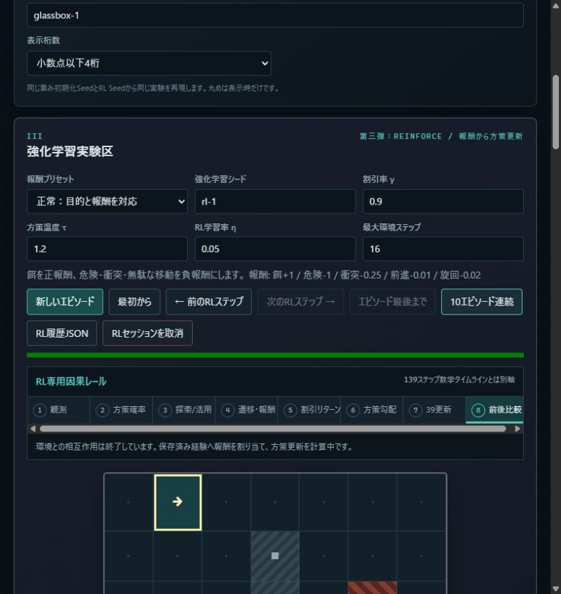

# Glassbox AI Suite

[](https://github.com/makotonanamori/glassbox-ai-suite/actions/workflows/ci.yml)
[](https://github.com/makotonanamori/glassbox-ai-suite/actions/workflows/pages.yml)

**MIT · Vanilla JavaScript · Local-first · No external AI API · No pretrained model**

Glassbox AI Suiteは、AIが入力を確率へ変換し、学習信号から勾配を求め、Parameterを更新して次の出力を変えるまでを実数値で観察する教育用ブラウザ実験室です。

高性能なAI製品ではありません。外部API、学習済みモデル、機械学習ライブラリ、外部CDN、遠隔測定を使わず、すべての計算を小さなVanilla JavaScript実装で実行します。

- Source: https://github.com/makotonanamori/glassbox-ai-suite

## ブラウザですぐ試す

**[Glassbox AI Suiteをブラウザですぐ試す →](https://makotonanamori.github.io/glassbox-ai-suite/)**

ダウンロードやインストールは不要です。GitHub Pagesを開くだけで、実際の計算・可視化・学習をブラウザ内で操作できます。

初めての場合は、シリーズ共通入口から次の順番で試すことを推奨します。各教材へ直接入ることもできます。

1. **[Glassbox AI I：正解との誤差から学ぶ](https://makotonanamori.github.io/glassbox-ai-suite/glassbox-ai/)** — 5→4→3ニューラルネットの順伝播、Loss、誤差逆伝播、全39 Parameter更新
2. **[Glassbox AI II：次Tokenの誤差から学ぶ](https://makotonanamori.github.io/glassbox-ai-suite/glassbox-ai-ii/)** — 極小TransformerのToken、Attention、Logits、次Token確率、Cross Entropy、SGD更新
3. **[Glassbox AI III：行動の結果から学ぶ](https://makotonanamori.github.io/glassbox-ai-suite/glassbox-ai-iii/)** — 7×7環境、探索/活用、累積報酬、割引Return、REINFORCE方策更新

各入口は対象アプリの初回ガイドを表示し、次に押すボタンへfocusします。表示値は既存StepEngineまたはclone保存したForward Traceから取得し、入口用のダミー計算はありません。

## ローカルで実行する

Windowsではrepositoryを取得後、suite rootで次のlauncherを実行します。

```powershell
.\start-glassbox-ai-suite.cmd
```

表示されたURLをブラウザで開くと、シリーズ共通入口が表示されます。

### Pythonで手動起動する

Python 3が利用できる環境では、suite rootで次を実行できます。

```powershell
python -m http.server 8000 --bind 127.0.0.1
```

ブラウザで`http://127.0.0.1:8000/`を開きます。ES Modulesを使うため、`index.html`の直接ダブルクリックは対象外です。

### Glassbox AI IIとIIIを別々に起動する

IIとIIIはruntime依存のない独立directoryです。Windowsでは別々のPowerShellから次を実行します。

```powershell
Set-Location .\glassbox-ai-ii
.\start-glassbox-ai-ii.cmd

Set-Location ..\glassbox-ai-iii
.\start-glassbox-ai-iii.cmd
```

既定URLはIIが`http://127.0.0.1:8102/`、IIIが`http://127.0.0.1:8103/`です。どちらか一方だけの起動も、両方の同時起動も可能です。使用中のportは停止せず、各launcherが近傍の空きportへ切り替えて実URLを表示します。

## 開発・テストする

Node.js 24を推奨します。外部packageのinstallは不要です。

```powershell
npm run check
```

この1コマンドで次を実行します。

- Series landingのlink、ID、外部依存境界、公開対象境界、MIT License検査
- `glassbox-ai`の構文、順伝播、逆伝播、serialization、教師あり勾配チェックとlegacy互換回帰
- `glassbox-ai-ii`のTensor、Attention、serialization、主要Parameter勾配チェック、500 step数値安定性
- `glassbox-ai-iii`の独立性、RL数学、snapshot、履歴、全39方策勾配チェック

個別実行も可能です。

```powershell
npm run test:portal
npm run test:neural
npm run test:language
npm run test:reinforcement
```

## 実画面

[](https://makotonanamori.github.io/glassbox-ai-suite/)

上のGIFと以下のScreenshotは、GitHub Pagesで動作する実アプリを同一viewportで撮影したものです。説明用のダミー値や生成画像ではありません。

| Glassbox AI I | Glassbox AI II | Glassbox AI III |
| --- | --- | --- |
|  |  |  |

Series landingの静止画は[こちら](./docs/media/landing.png)です。

## 収録している実験

### Glassbox AI I — `glassbox-ai`

- 5入力→4中間→3出力
- tanh、softmax、cross entropy、SGD
- 教師あり139ステップ数学タイムライン
- 139 snapshotの自動再生、一時停止・再開、速度変更
- JSON保存、Seed再現、全39勾配チェック

このdirectoryのcanonicalな責務は教師あり学習です。分離前のGrid World / REINFORCE実装は保存形式と回帰検証の互換層として内部に凍結保持しますが、通常UIとシリーズ導線には表示しません。

### Glassbox AI II — `glassbox-ai-ii`

- Context 8、`d_model=8`、2 Attention heads、1 Transformer block
- Learned Token / Position embedding、Pre-LayerNorm、GELU、Residual
- Causal Attention、Vocabulary projection、次Token softmax
- Reverse-mode autograd、Cross Entropy、SGD、global gradient clipping
- 16段階Forward Trace、Attention Inspector、Training、Generation、Snapshot
- 候補確率 → 1 Token選択 → 文末追加 → 反復を5 Token見せる生成ループ、一時停止・再開、速度変更
- 同じPromptの学習前／500回後を、候補確率・生成文・Corpus平均Lossで並べる初心者向け実Training比較
- JSON保存、Seed再現、有限差分Gradient Check

### Glassbox AI III — `glassbox-ai-iii`

- IIを起動せず動作する独立した静的browser app
- 7×7 Grid World、5 sensor、温度付き確率方策
- 環境履歴、探索/活用、累積報酬、割引Return
- REINFORCE方策勾配と全39 Parameter更新
- 10エピソードの実移動を連続表示し、一時停止・再開・速度変更
- 完全snapshotのRL専用因果timeline、履歴JSON、Seed再現

## 三つの学習信号

```text
Glassbox AI I   : 人が指定した正解ラベルとの誤差
Glassbox AI II  : 実際に次に現れたTokenとの予測誤差
Glassbox AI III : 環境遷移後の報酬と割引Return
```

三つには「入力 → Parameter計算 → 確率 → 学習信号 → Gradient → 更新」という共通骨格があります。一方、強化学習を通常の言語モデル事前学習と同一視せず、観測事実と解釈を分離します。

## Roadmap・変更履歴・貢献・Security

- [ROADMAP.md](./ROADMAP.md) — 現在のbaseline、Now / Next / Later、非目標
- [CHANGELOG.md](./CHANGELOG.md) — 公開baselineからの利用者向け変更履歴
- [「自動で見る」共通UX](./docs/AUTO_OBSERVE_UX.md) — 初心者向けの二段構造と実値表示契約
- [CONTRIBUTING.md](./CONTRIBUTING.md) — 数学、Trace、browser検証を含む変更原則
- [Security Policy](./SECURITY.md) — 対応範囲とPrivate vulnerability reporting
- [Bug report](https://github.com/makotonanamori/glassbox-ai-suite/issues/new?template=bug_report.yml) / [Feature request](https://github.com/makotonanamori/glassbox-ai-suite/issues/new?template=feature_request.yml)

## ファイル構成

```text
glassbox-ai-suite/
├─ index.html
├─ css/style.css
├─ glassbox-ai/
├─ glassbox-ai-ii/
├─ glassbox-ai-iii/
├─ tests/portal.test.js
├─ docs/media/
├─ ROADMAP.md
├─ CHANGELOG.md
├─ .github/workflows/ci.yml
├─ start-glassbox-ai-suite.cmd
├─ start-glassbox-ai-suite.ps1
├─ package.json
├─ CONTRIBUTING.md
├─ SECURITY.md
└─ LICENSE
```

## 公開方法

このdirectoryだけを静的hostingの公開rootとして配置します。親workspaceにはGlassbox以外の作業物があるため、親directoryを公開rootにしないでください。

GitHub Pagesでは、`main`へのpush時に全テストを実行し、成功した内容だけを専用Actions workflowから公開します。

- 公開URL: https://makotonanamori.github.io/glassbox-ai-suite/
- Repository: https://github.com/makotonanamori/glassbox-ai-suite

landing、`/glassbox-ai/`、`/glassbox-ai-ii/`、`/glassbox-ai-iii/`は同じ公開rootから配信されます。ローカルではIIとIIIをそれぞれ専用launcherで独立起動できます。

## 既知の制限

- 実用AIや大規模言語モデルではなく、原理を観察する固定小型モデルです。
- IとIIIは同じ5→4→3構造を別々の自己完結実装として利用しますが、学習信号とcanonical UIは分離しています。
- REINFORCEは分散が大きく、エピソード報酬が単調に改善する保証はありません。
- 言語モデルは単純なword/punctuation tokenizer、Context 8、固定12文Corpusです。
- Security上の問題はGitHub Private vulnerability reportingから非公開で報告できます。

## License

[MIT License](./LICENSE)。
